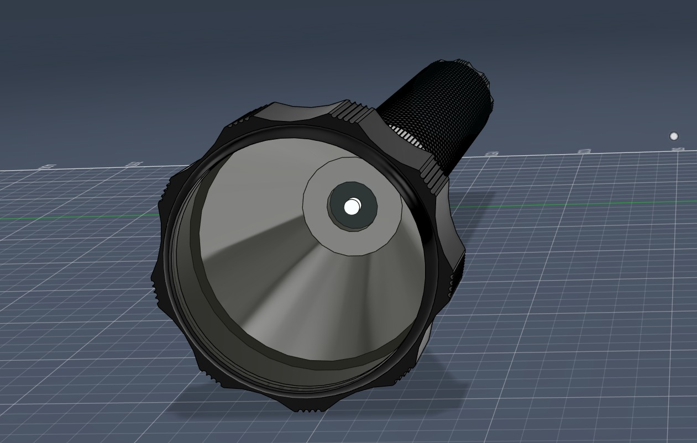
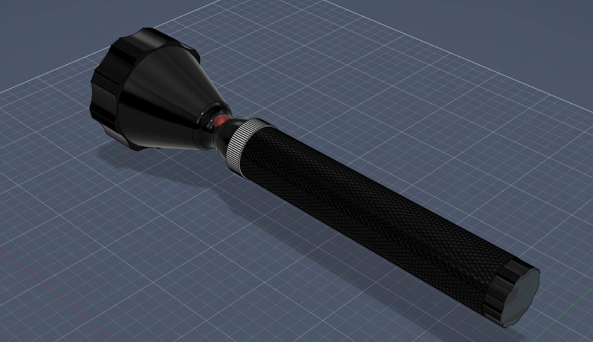
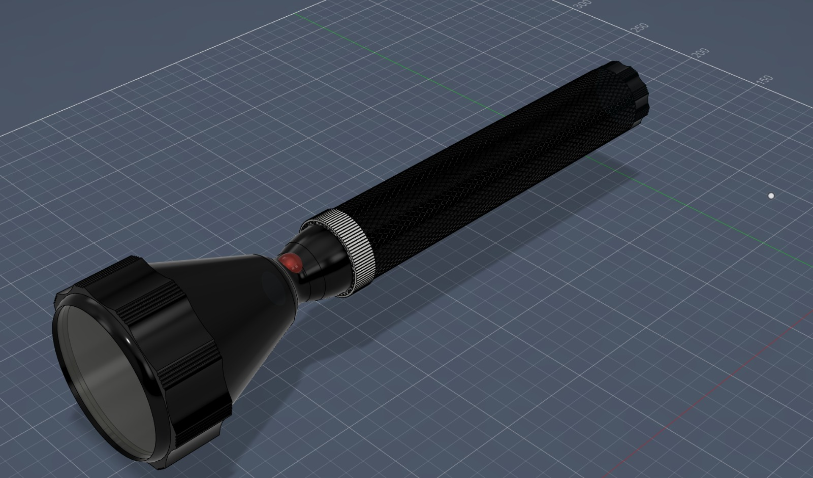

# Torch Light CAD Design

A detailed 3D CAD model of a portable torch light created as a product design project. The model focuses on realistic proportions, ergonomic handling, textured grip surfaces, switch placement, and clean industrial styling.

## Project Preview

### Front View

### Orthographic View

### Perspective View

## Features

- Realistic torch light body design  
- Ergonomic textured grip handle  
- Front reflector and lens housing  
- Side switch integration  
- Clean industrial product styling  
- Detailed 3D surface modeling  

## Design Focus

- Mechanical CAD modeling  
- Product visualization  
- Surface detailing  
- Consumer product concept design  
- Practical handheld ergonomics  

## Tools Used

- Autodesk Fusion 360

## Applications

- Product design portfolio  
- Mechanical CAD practice  
- Consumer electronics concept modeling  
- Rendering and prototyping reference  

## Future Improvements

- Internal battery compartment design  
- Exploded assembly view  
- Photorealistic rendering  
- Manufacturing drawings  
- Waterproof casing redesign
